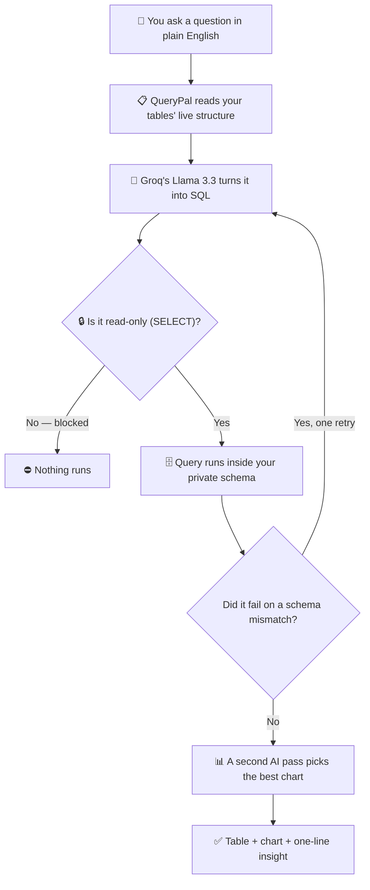
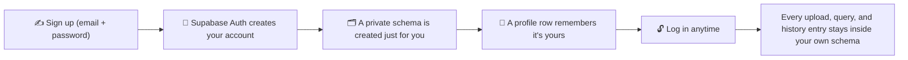

# QueryPal 🔍

**Ask your data questions in plain English — no SQL required.**

QueryPal turns a spreadsheet into something you can *talk to*. Sign up, drop in a CSV or Excel file, type a question the way you'd ask a colleague, and get back a real answer: the SQL that ran, a results table, an auto-picked chart, and a one-line takeaway. Everything runs on Supabase (managed Postgres) and deploys as a single Streamlit app — your data stays private to your own account, in its own corner of the database.

---

## See it in action

```
You:      "How many companies are in each region?"

QueryPal: SELECT region, COUNT(*) AS company_count
          FROM companies
          GROUP BY region
          ORDER BY company_count DESC
          LIMIT 100;

Result:   Table + bar chart + "North region leads with the highest concentration"
```

---

## How a question becomes an answer



Every arrow above is a real, separate step in the code — not marketing. If a generated query references a column that doesn't exist, the actual database error gets fed back to the model for exactly one automatic correction before anything reaches you.

---

## Signing up, in short



Nobody else can see your tables, and you can't see theirs — each account is boxed into its own private slice of the same database.

---

## Features

| Feature | What it does | What makes it work |
|---|---|---|
| **Accounts** | Sign up / log in; your data is yours alone | Supabase Auth, via the `supabase-py` client |
| **Upload your own data** | Drop a CSV/Excel file, it becomes a real table instantly | `pandas` reads the file, `SQLAlchemy`'s `to_sql()` creates the table |
| **Plain English queries** | Ask a question, get SQL + results | Groq-hosted Llama 3.3, called through `LangChain` |
| **Multi-table querying** | Ask questions that need a join across tables | Foreign keys read live from Postgres and handed to the LLM as a hint |
| **Auto visualisation** | A chart appears without you choosing one | A second LLM pass (`chart_agent.py`) picks type + axes from the actual result data |
| **3-variable charts** | Charts can show a third dimension — color, bubble size, or a full 3D scatter | Plotly Express's `color`/`size`/`scatter_3d` parameters |
| **Safety validator** | Only ever reads data — never writes or deletes | A dedicated keyword/shape check (`validator.py`), independent of what the LLM was told |
| **Self-correcting SQL** | A hallucinated column name doesn't just fail | The real Postgres error is fed back to the LLM for one automatic retry |
| **Per-account data isolation** | Your uploads and history are private | A real Postgres schema per account + `SET search_path` scoping every query |
| **Query history** | Past questions survive logging out and back in | Persisted in a Postgres table, not just browser memory |
| **CSV & chart export** | Download your results or the chart image | `st.download_button` (pandas CSV) + `kaleido` (chart PNG) |
| **Per-account rate limit** | Protects the shared AI quota from runaway use | Reuses the query-history table itself as a rolling 24h counter |
| **Plain-language errors** | Failures read like a sentence, not a stack trace | A translation layer maps technical errors to friendly messages, with the raw one still available behind a toggle |
| **Single deployment** | One app, no separate backend to host | Streamlit calls the AI/database logic directly, in-process |

---

## Tech Stack

| Layer | Tool | Why |
|---|---|---|
| App / UI | Streamlit | One Python file renders the UI *and* calls the AI/database logic directly — no separate frontend or API layer |
| Auth | Supabase Auth (`supabase-py`) | Sign up / log in / sessions. Identity only — data queries still go through SQLAlchemy below |
| LLM inference | Groq (Llama 3.3 70B) | Very fast inference for SQL generation and chart selection |
| LLM orchestration | LangChain (`langchain-core` via `langchain-groq`) | Structures the system/human prompt sent to the model |
| Database | Supabase (PostgreSQL) | Managed Postgres with a browser dashboard — no server to patch or back up by hand |
| Database ORM | SQLAlchemy | Dynamic schema inspection via `inspect()`, plus `to_sql()` for uploads, scoped per-account with `schema=` |
| Charts | Plotly + `kaleido` | Interactive charts in-app; `kaleido` renders them to static PNG for download |
| Hosting | Streamlit Community Cloud | Free hosting, deploys straight from GitHub |

---

## Project Structure

```
QueryPal/
├── requirements.txt
├── .env.example                 # Local dev only — see Environment Variables
├── .streamlit/
│   └── secrets.toml.example    # Template for Streamlit Cloud's Secrets manager
│
├── app/
│   ├── auth/
│   │   └── supabase_auth.py   # Sign up / log in / log out, schema provisioning for new accounts
│   │
│   ├── database/
│   │   ├── db.py               # Two SQLAlchemy engines: pooled (queries) + direct/session (DDL)
│   │   ├── uploader.py         # CSV/Excel upload (create + insert) and table delete logic
│   │   └── query_history.py   # Per-account query history + the rate-limit counter, persisted in Postgres
│   │
│   ├── agent/
│   │   ├── schema_loader.py   # Reads live DB schema — one table, several, or all
│   │   ├── sql_agent.py       # English → SQL via LLM, with one retry on schema-mismatch errors
│   │   ├── chart_agent.py     # Results → chart config via LLM
│   │   └── validator.py       # SELECT-only safety check
│   │
│   └── ui/
│       └── streamlit_app.py   # The entire app: auth gate, UI, query orchestration — calls app/agent and app/database directly
│
└── tests/
    └── test_agent.py
```

> QueryPal previously ran as a FastAPI backend + static HTML/JS frontend on Vercel. That architecture has been retired in favor of one Streamlit app that calls the agent and database modules in-process — no HTTP hop, no separate API to host.

---

## Getting Started

### Prerequisites

- Python 3.11+
- A [Supabase](https://supabase.com) project (free tier is enough)
- Groq API key — free at [console.groq.com](https://console.groq.com)

### 1. Clone the repo

```bash
git clone https://github.com/KirtiK07/QueryPal.git
cd QueryPal
```

### 2. Create and activate a virtual environment

```bash
python -m venv venv

# Windows
venv\Scripts\activate

# Mac / Linux
source venv/bin/activate
```

### 3. Install dependencies

```bash
pip install -r requirements.txt
```

### 4. Set up the accounts tables

Run this once in Supabase's SQL editor:

```sql
create table public.profiles (
  id uuid primary key references auth.users(id) on delete cascade,
  email text not null,
  role text not null default 'user' check (role in ('user', 'admin')),
  schema_name text not null unique,
  created_at timestamptz not null default now()
);

create table public.query_history (
  id bigint generated always as identity primary key,
  user_id uuid not null references auth.users(id) on delete cascade,
  question text not null,
  generated_sql text,
  tables text[] not null default '{}',
  row_count integer,
  chart_type text,
  created_at timestamptz not null default now()
);

alter table public.profiles enable row level security;
alter table public.query_history enable row level security;
create policy "own profile" on public.profiles for select using (auth.uid() = id);
create policy "own history" on public.query_history for all using (auth.uid() = user_id);
```

Also turn off **Confirm email** under Authentication → Sign In / Providers → Email. Supabase's default free-tier email relay has a very low send-rate limit, so leaving confirmation on will make signups fail with "email rate limit exceeded" the moment that cap is hit.

### 5. Configure environment variables

Create a `.env` file in the root (see [Environment Variables](#environment-variables) below for where to find each value in the Supabase dashboard):

```env
DATABASE_URL=postgresql://postgres.<project-ref>:<password>@aws-0-<region>.pooler.supabase.com:6543/postgres
DATABASE_URL_DIRECT=postgresql://postgres.<project-ref>:<password>@aws-0-<region>.pooler.supabase.com:5432/postgres
GROQ_API_KEY=gsk_your_key_here
MODEL_NAME=llama-3.3-70b-versatile
SUPABASE_URL=https://<project-ref>.supabase.co
SUPABASE_ANON_KEY=your_anon_key_here
```

### 6. Start the app

```bash
streamlit run app/ui/streamlit_app.py
```

Open the local URL Streamlit prints (usually [http://localhost:8501](http://localhost:8501)). Sign up, then upload a CSV or Excel file from the "Step 1 — Upload a dataset" panel — there's no separate schema-setup step.

---

## Accounts & Data Isolation

Every account gets its own Postgres schema (`user_<id>`), created the moment it signs up. Uploaded tables live only in that schema, and every query the app runs sets `search_path` to that schema first — so the AI-generated SQL, which is always unqualified (`SELECT * FROM my_table`), naturally resolves against the right account's tables without `sql_agent.py` ever needing to know accounts exist.

Worth being precise about what's actually enforcing this: the app talks to Postgres through one fixed connection, not a per-user Supabase connection, so **Postgres Row-Level Security is not what enforces this isolation** — the app's own schema-scoping is. RLS is still enabled on `profiles` and `query_history` as defense-in-depth (relevant if those tables are ever queried directly through Supabase's REST API), but it isn't the primary mechanism.

There's no admin role by design — every account is treated the same. If you ever need to look at another account's data for support or debugging, do it directly in the Supabase dashboard rather than in-app.

---

## Sample Queries

```
Show all rows
How many records are in each category?
Which category has the most records?
List everything alphabetically by name
Show rows whose name contains 'Ltd'
Which group has the least number of records?
```

---

## Safety

QueryPal enforces read-only access at the validator layer — not just at the prompt level.

- Every generated query is checked before execution
- The first word must be `SELECT` — anything else is rejected
- Blocked keywords: `DROP`, `DELETE`, `INSERT`, `UPDATE`, `ALTER`, `TRUNCATE`, `CREATE`
- System tables (`pg_shadow`, `pg_authid`) are explicitly blocked in the prompt
- `LIMIT` is only ever applied to the final result set — never to rows feeding a `GROUP BY`, so an aggregate question like "total male/female count" scans the whole table, not a sample of it
- If the LLM can't answer from the schema, it returns `CANNOT_GENERATE` instead of hallucinating
- Uploaded table and column names are sanitized into safe SQL identifiers before any `CREATE TABLE`/`INSERT` — never taken as raw, unescaped input
- Each account is capped at 20 questions per rolling 24 hours, to keep one account from exhausting the shared Groq quota

---

## Extending

**Connect a different database** — change `DATABASE_URL` / `DATABASE_URL_DIRECT` in `.env` (or Streamlit Cloud's Secrets). Any Postgres-compatible target works the same way; MySQL/SQLite are also supported by changing the URL scheme, though the two-connection (pooled + direct) split is specific to Supabase's architecture.

**Swap the LLM** — change two lines in `sql_agent.py` and `chart_agent.py`:
```python
from langchain_openai import ChatOpenAI
llm = ChatOpenAI(model="gpt-4o", temperature=0)
```

---

## Environment Variables

| Variable | Description |
|---|---|
| `DATABASE_URL` | Supabase **pooled** (transaction-mode, port 6543) connection string — used for all normal querying/schema reads. Find it under Project Settings → Database → Connection string → Transaction pooler. |
| `DATABASE_URL_DIRECT` | Supabase **session pooler** (port 5432, same host as `DATABASE_URL`) connection string — used only for schema/table creation on signup and upload. Must be the session pooler, not the true "Direct connection" shown in the dashboard — that one is IPv6-only and unreachable from most cloud platforms. |
| `GROQ_API_KEY` | API key from console.groq.com |
| `MODEL_NAME` | Groq model used for SQL/chart generation (currently `llama-3.3-70b-versatile`) |
| `SUPABASE_URL` | Your Supabase project URL — Project Settings → API |
| `SUPABASE_ANON_KEY` | Supabase's public `anon` key (not `service_role`) — same page, used only for Auth |

Locally these live in `.env` (loaded via `python-dotenv`). On Streamlit Cloud, set the same six keys in the app's **Settings → Secrets** — `streamlit_app.py` copies `st.secrets` into the environment on startup, so `app/database/db.py` doesn't need to know which source they came from.

---

## Deployment

QueryPal deploys as a single Streamlit Community Cloud app — no separate backend to host.

1. Push to GitHub.
2. On [share.streamlit.io](https://share.streamlit.io), create an app pointing at this repo, the `main` branch, and main file path `app/ui/streamlit_app.py`.
3. Under Advanced settings → Secrets, paste in the six variables from [Environment Variables](#environment-variables) (see `.streamlit/secrets.toml.example` for the exact format).
4. Deploy. Streamlit Cloud installs `requirements.txt` and runs the app — no build config needed beyond that.
